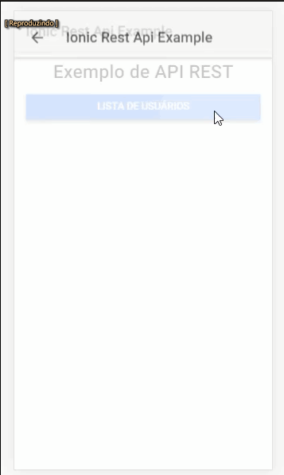

# get-rest-api-ionic-example
An example of usage ionic app for get api rest

## Telas / Screens: 

# To run:
* > npm install

* > ionic serve (run in browser)

or

* > ionic cordova run android 

or

* > ionic cordova run ios 

## Usage Api [reqres](https://reqres.in/) 
